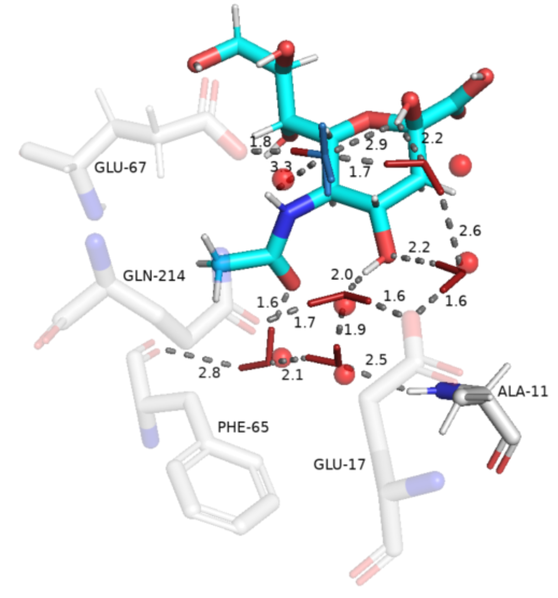

Examples
========

Full Conserved Water determination procedure
--------------------------------------------

To compute conserved waters from MD trajectories one has to first align the whole trajectory. Next step required is the extraction of water molecules of interest. These two step can be done using WNA package. A complete example for identification of conserved waters is given below:

.. code:: python

   from WaterNetworkAnalysis import align_trajectory, get_center_of_selection,get_selection_string_from_resnums,extract_waters_from_trajectory
   from ConservedWaterSearch.water_clustering import WaterClustering
   from ConservedWaterSearch.utils import get_orientations_from_positions
   
   # MD trajectory filename
   trajectory="md.xtc"
   # topology filename
   topology="md.gro"
   # aligned trajectory filename
   alignedtrj = "aligned_trj.xtc"
   # aligned snapshot filename
   aligned_snap = "aligned.pdb"
   # distance to select water molecules around
   distance = 12.0
   # align the trajectory and save the alignment reference configuration
   align_trajectory(
       trajectory=trj,
       topology=top,
       align_target_file_name=aligned_snap,
       output_trj_file=alignedtrj,
   )
   # define active site by aminoacid residue numbers
   active_site_resnums = [111, 112, 113, 122, 133, 138, 139, 142, 143, 157, 166, 167, 169, 170, 203, 231, 232, 238]
   # find centre of the active site in aligned trajectory
   selection_centre = get_center_of_selection(
       get_selection_string_from_resnums(active_site_resnums),
       trajectory=alignedtrj,
       topology=topology,
   )
   # extract water coordinates of interest around selection centre
   coordO, coordH =  extract_waters_from_trajectory(
       trajectory=alignedtrj, 
       topology=topology, 
       selection_center=selection_centre, 
       dist=distance
   )
   # start the clustering procedure
   Nsnaps = 200
   WC=WaterClustering(nsnaps=Nsnaps, save_results_after_done=False)
   # perform multi stage reclustering
   WC.multi_stage_reclustering(*get_orientations_from_positions(coordO,coordH))
   # visualise results with pymol
   WC.visualise_pymol(
       aligned_snap, 
       active_site_ids=active_site_resnums, 
       dist=distance
   )
   # manually save the results for later use
   res_fname = "results.dat"
   res_type_fname = "types.dat"
   WC.save_results(res_fname,res_type_fname)

With the following result:

Visualisation of previously saved results
-----------------------------------------

Apart from direct visualisation from the :py:class:`WaterClustering` class functions, results can also be visualised using WNA via `MDAnalysis <https://www.mdanalysis.org/>`_ by using :py:meth:`WaterNetworkAnalysis.make_results_pdb_MDA` by passing the array results:

.. code:: python

   from WaterNetworkAnalysis import make_results_pdb_MDA
   make_results_pdb_MDA(
       water_type=WC.water_type,
       waterO=WC.waterO,
       waterH1=WC.waterH1,
       waterH2=WC.waterH2,
       output_fname="visualisation.pdb"
       protein_file=aligned_snap,
       mode="cathegorise"
   )

or from previously saved files using the convenience function :py:meth:`WaterNetworkAnalysis.read_results_and_make_pdb`. This will create a pdb file with results:

.. code:: python 

   from WaterNetworkAnalysis import 
   read_results_and_make_pdb(
       fname=res_fname,
       typefname=res_type_fname,
       output_fname="visualisation.pdb"
       protein_file=aligned_snap,
       mode="cathegorise"
   )

Alignment and extraction of waters in a single step
---------------------------------------------------

For convenience one can perform alignment and extraction of water molecules in a single step:

.. code:: python

   from WaterNetworkAnalysis import align_and_extract_waters, get_center_of_selection,get_selection_string_from_resnums
   # MD trajectory filename
   trajectory="md.xtc"
   # topology filename
   topology="md.gro"
   # aligned trajectory filename
   alignedtrj = "aligned_trj.xtc"
   # aligned snapshot filename
   aligned_snap = "aligned.pdb"
   # distance to select water molecules around
   distance = 12.0
   # define active site by aminoacid residue numbers
   active_site_resnums = [111, 112, 113, 122, 133, 138, 139, 142, 143, 157, 166, 167, 169, 170, 203, 231, 232, 238]
   # find centre of the active site in aligned trajectory
   selection_centre = get_center_of_selection(
       get_selection_string_from_resnums(active_site_resnums),
       trajectory=alignedtrj,
       topology=topology,
   )
   # align the trajectory, save the alignment reference configuration and extract relevent waters
   coordO, coordH = align_and_extract_waters(
       selection_centre, 
       trj, 
       alignedtrj, 
       aligned_snap, 
       topology, 
       dist = distance
   )

Calculation of oxygen (water) density maps
------------------------------------------

To confirm the validity of the results it is sometimes prudent to check if the calculated conserved waters map to all the water oxygen density spots in the simulation. If some density hot spots are not mapped properly clustering parameters can be adjusted and conserved waters re-evaluated to obtain better results.

WNA supports calculation of oxygen density maps using `MDAnalysis <https://www.mdanalysis.org/>`_:

.. code:: python

   from WaterNetworkAnalysis import align_and_extract_waters, get_center_of_selection,get_selection_string_from_resnums
   # MD trajectory filename
   trajectory="md.xtc"
   # topology filename
   topology="md.gro"
   # aligned trajectory filename
   alignedtrj = "aligned_trj.xtc"
   # aligned snapshot filename
   aligned_snap = "aligned.pdb"
   # distance to select water molecules around
   distance = 12.0
   # name of water density map file
   watdens_fname = 'water.dx'
   # define active site by aminoacid residue numbers
   active_site_resnums = [111, 112, 113, 122, 133, 138, 139, 142, 143, 157, 166, 167, 169, 170, 203, 231, 232, 238]
   # find centre of the active site in aligned trajectory
   selection_centre = get_center_of_selection(
       get_selection_string_from_resnums(active_site_resnums),
       trajectory=alignedtrj,
       topology=topology,
   )
   calculate_oxygen_density_map(
       selection_center=selection_centre,
       trajectory=alignedtrj,
       topology=topology,
       dist=distance,
       output_name=watdens_fname,
   )

The density map can be visualised together with the conserved water clustering results from :py:class:`WaterClustering`:

.. code:: python

   WC.visualise_pymol(
       aligned_snap, 
       active_site_ids=active_site_resnums, 
       dist=distance, 
       density_map=watdens_fname
   )
